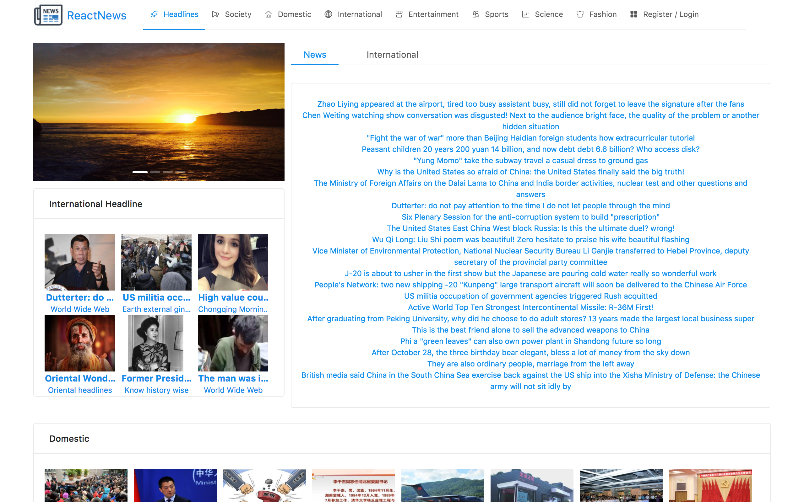
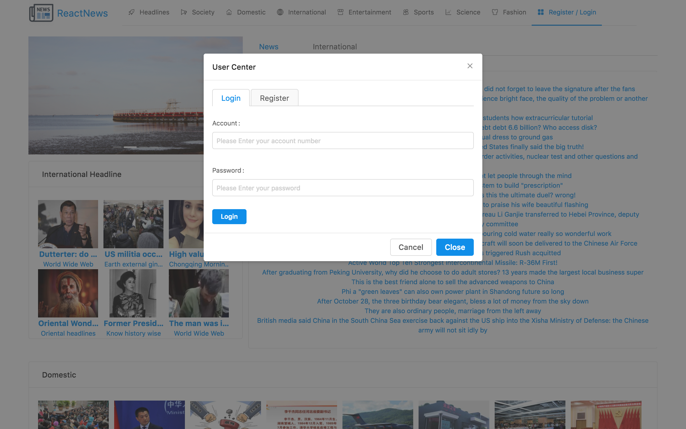
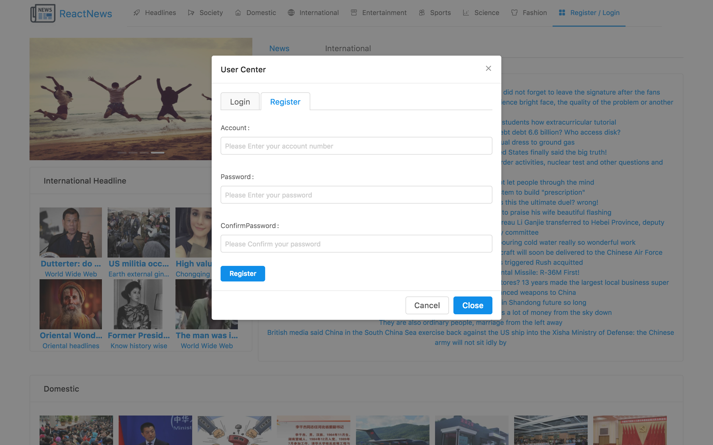
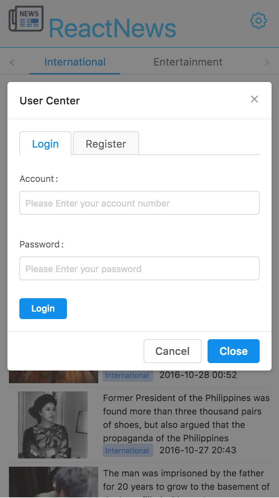

# React News website
**The Website** develop functions such as

    •Daily News pushing
    •Detail display of news
    •User Profile
    
**Features**  

    •React framework
    •responsive design (Ant design & react open source)

# Screenshots of The Website
#### • `Website intial screen 1` 

#### • `Website intial screen 2` 

#### • `Website Login` 

#### • `Website Register` 

# Mobile Version of the Web App
#### • `Mobile intial screen`

# Mobile Version of the Web App
#### • `Mobile Login and Register`

# License
   Copyright {2017} {Liangchen Zhou}
   
   Licensed under the Apache License, Version 2.0 (the "License");
   you may not use this file except in compliance with the License.
   You may obtain a copy of the License at
   
       http://www.apache.org/licenses/LICENSE-2.0
       
   Unless required by applicable law or agreed to in writing, software
   distributed under the License is distributed on an "AS IS" BASIS,
   WITHOUT WARRANTIES OR CONDITIONS OF ANY KIND, either express or implied.
   See the License for the specific language governing permissions and
   limitations under the License.
